### Hi, I'm Sunil.

I build scalable, reliable and developer-friendly software that solves real-world problems, with 6+ years across web applications, APIs and cloud-native solutions.

Right now I'm a Software Engineer II at **Cubic³** in Dublin, engineering connected-mobility platforms that link mobile network operators such as Vodafone with automotive OEMs such as Volkswagen Group, supporting 3.5M+ connected devices.

Most repos on this account are older side projects. For the full picture, see the portfolio.

## Skills

            

## Timeline

|                                                                                    | When              | What                                                           |
| ---------------------------------------------------------------------------------- | ----------------- | -------------------------------------------------------------- |
|  | 01/2025 – Present | **Software Engineer II**, Cubic³, Dublin                       |
|  | 04/2023 – 12/2024 | **Software Engineer I**, Aryza Ireland Ltd, Dublin             |
|  | 01/2023           | **MSc Artificial Intelligence**, Dublin Business School        |
|      | 05/2021 – 12/2021 | **Software Engineer I**, LearningMate Solutions, Mumbai        |
|      | 06/2020 – 04/2021 | **Jr. Software Engineer**, Acideas Solutions / CRMNEXT, Mumbai |
|      | 03/2019 – 06/2020 | **Software Engineer**, DIMA Engineering, Mumbai                |
|      | 2018              | **PG Diploma in Advanced Computing**, CDAC Mumbai              |
|      | 11/2016 – 11/2017 | **Electrical Engineer**, IUS Equipment’s, Mumbai               |
|      | 2016              | **BSc Electrical Engineering**, Mumbai University              |

## Say hello

Happy to talk about engineering work, collaboration, or a role.

  
